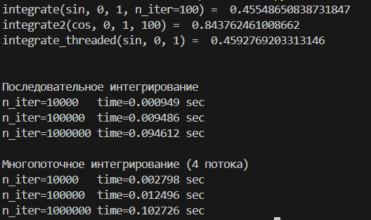
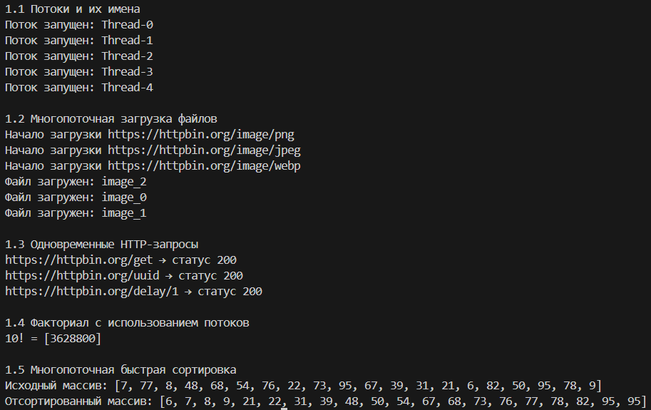
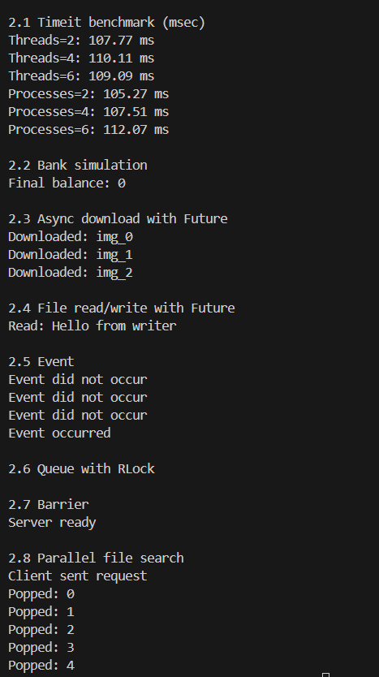
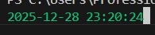
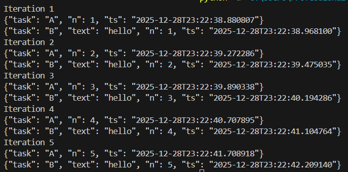
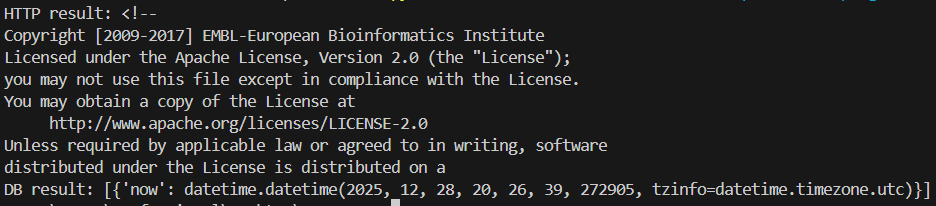
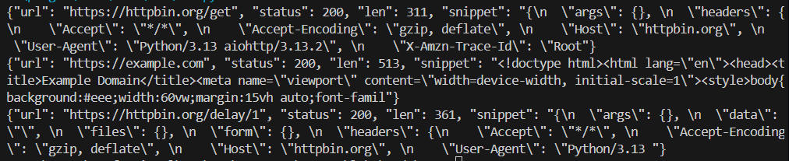
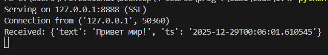
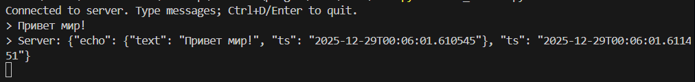

# Щеткин Дмитрий ИВТ 2.1

## Лабораторная работа #1

### Часть 1: Простое интегрирование

[Код](https://github.com/Mytyai/4-course/tree/master/prog-7/lab1/code/1.1.py)

Результат:

### Часть 2: Потоки в Python

[Код](https://github.com/Mytyai/4-course/tree/master/prog-7/lab1/code/1.2.py)

Результат:

### Часть 3: Concurrency и Futures

[Код](https://github.com/Mytyai/4-course/tree/master/prog-7/lab1/code/1.3.py)

Результат:

### Часть 4: Асинхронность

[Код](https://github.com/Mytyai/4-course/tree/master/prog-7/lab1/code/1.4)

Результат:

1.1:

1.2:

1.3:

1.4:

1.5-1.6:

1.7:

