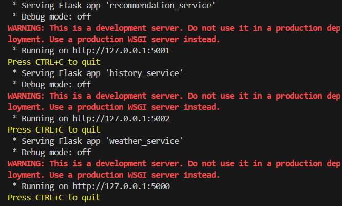

# Щеткин Дмитрий ИВТ 2.1

## Лабораторная работа #2 - WSGI и ASGI

## Вариант 1: Агрегатор погодных данных

### Микросервисы с многопроцессностью

В файле [services.py](https://github.com/Mytyai/4-course/tree/main/prog-7/lab2/weather-app/services.py) реализовано несколько микросервисов:

- Сервис получения погоды
- Сервис рекомендаций
- Сервис истории запросов

Проверка запуска файла:

### Инструкция по локальному запуску

1. Получите API key в OpenWeatherMap.
2. Сохраните API key с помощью PowerShell `setx WEATHER_API_KEY "ВАШ_API_KEY"`.
3. Запустите `python services.py`.
4. Сервисы доступны по ссылкам (пример города - Москва):
- `http://127.0.0.1:5000/weather?city=Moscow`
- `http://127.0.0.1:5001/recommend`
- `http://127.0.0.1:5002/history`
- `http://127.0.0.1:5002/stats`

### Инструкция по запуску через Docker

1. Сборка образа `docker build -t weather-app .`
2. Запуск контейнера `docker run -p 5000:5000 -p 5001:5001 -p 5002:5002 --name my-weather-app weather-app`

### Инструкция по развертыванию в Yandex Cloud

1. Сборка образа `docker build -t weather-app .`
2. Авторизуйтесь в Yandex Container Registry `yc container registry login`
3. Создайте репозиторий и загрузите образ:
- `docker tag weather-app cr.yandex/<folder-id>/weather-app:latest`
- `docker push cr.yandex/<folder-id>/weather-app:latest`
4. Создайте Serverless Container на основе образа
5. Настройте API-ключ
6. Создайте HTTP-триггер для доступа к сервисам
