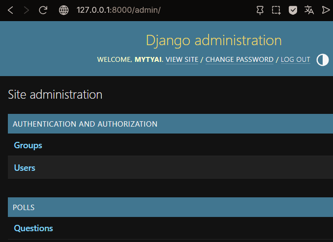
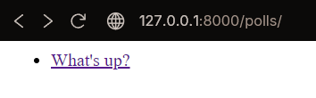
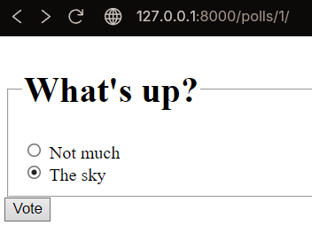
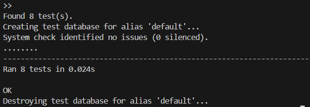
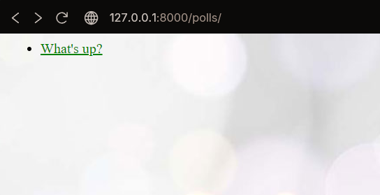
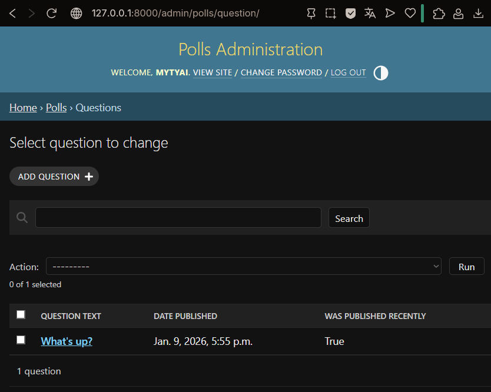

# Щеткин Дмитрий ИВТ 2.1

## Лабораторная работа #3 - Введение в Django

### Отчет

Часть 1: Запросы и ответы
- Создан проект Django и приложение polls внутри
- Написана первая view-функция index
- Настроены URL-маршруты для приложения

Часть 2: Модели и админка
- Настроена база данных и миграции для приложения polls
- Созданы модели Question и Choice с методами и связями
- Сконфигурирована и протестирована Django admin

Часть 3: Представления и шаблоны
- Созданы новые представления (views)
- Подключены шаблоны Django
- Настроены URL-адреса и namespace приложения polls

Часть 4: Формы и обобщенные представления
- Создана форма голосования на странице вопроса (detail.html)
- Реализована функция vote()
- Введены generic views (ListView и DetailView)

Часть 5: Тестирование
- Созданы автоматические тесты для метода модели was_published_recently()
- Исправлен баг в методе was_published_recently(), чтобы вопросы с датой в будущем не считались недавними.
- Написаны тесты для представлений (IndexView и DetailView)

Часть 6: Статические файлы
- Создана структура статических файлов
- Подключен CSS к шаблону index.html
- Добавлено фоновое изображение через CSS

Часть 7: Настройка интерфейса администратора
- Настройка админки для модели Question
- Добавление inline-редактирования Choices
- Кастомизация внешнего вида админки

### Инструкция

1. Перейдите в директорию проекта
2. Примените миграции базы данных `python manage.py makemigrations`, `python manage.py migrate`
3. Создайте суперпользователя для админки `python manage.py createsuperuser`
4. Запуск сервера: `python manage.py runserver`
- Главная страница: http://127.0.0.1:8000/polls/
- Админка: http://127.0.0.1:8000/admin/
6. Для запуска тестов: `python manage.py test polls`

