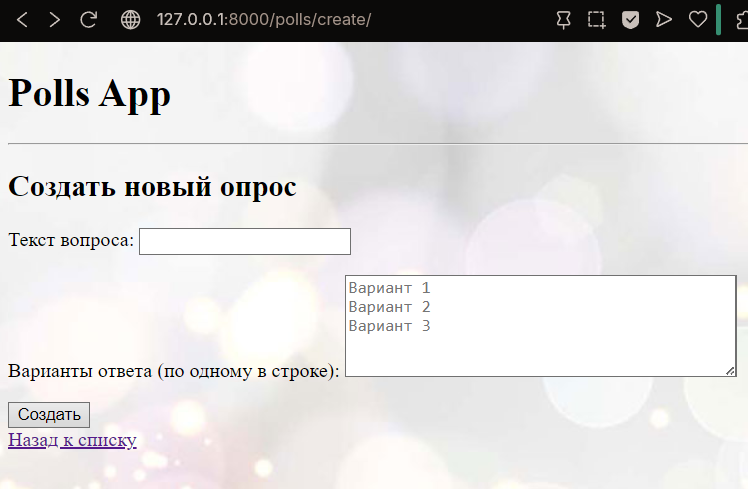
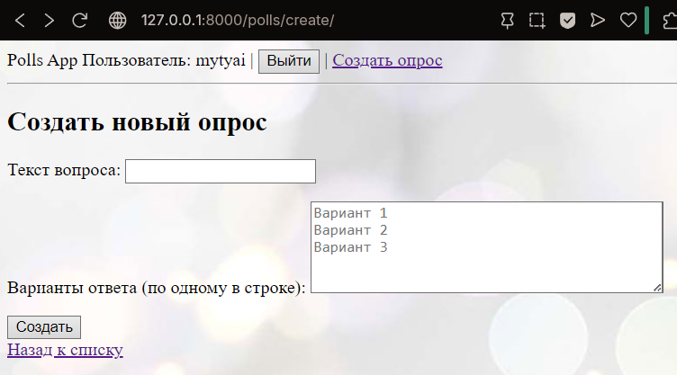
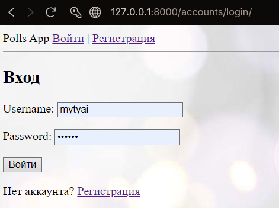
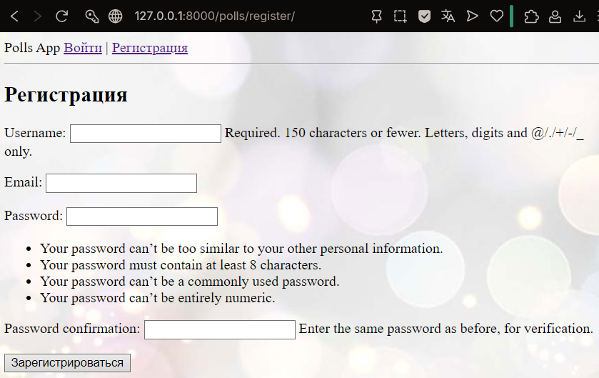

# Щеткин Дмитрий ИВТ 2.1

## Лабораторная работа #4 - Применение форм в Django. Аутентификация и регистрация пользователей.

### Отчет

1.1 Создание новых опросов через форму: 
- Создана форма `QuestionCreateForm` с полем для заголовка вопроса и текстовой областью для вариантов ответа.  
- Реализовано представление `create_question`, которое сохраняет новый вопрос и связанные варианты (`Choice`).  
- Добавлен шаблон `create_question.html` с этой формой и интеграцией в `base.html` для отображения на сайте. 

1.2 Аутентификация и регистрация: 
- Созданы страницы и представления для регистрации (`register`) и входа (`login`) пользователей.  
- Настроена серверная часть с использованием стандартной системы аутентификации Django (`User`, `login`, `logout`).  
- В `base.html` добавлен блок отображения текущего пользователя, а ссылки на создание опроса, вход и регистрацию зависят от статуса аутентификации.

