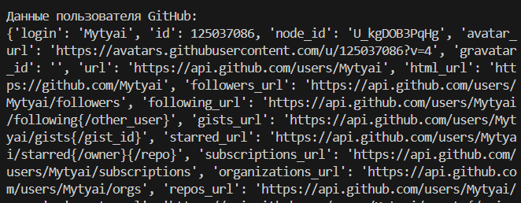

# Щеткин Дмитрий ИВТ 2.1

## Лабораторная работа - практика OAuth 2.0 в Python

### Инструкция

1. Зарегистрируйте OAuth на GitHub.
2. Укажите в Homepage URL и Authorization callback URL http://localhost:8080 и http://localhost:8080/callback соответственно.
3. Сохраните Client ID и Client Secret с помощью PowerShell `setx CLIENT_ID "ВАШ_CLIENT_ID"`,
`setx CLIENT_SECRET "ВАШ_CLIENT_SECRET"`.
4. Запустите `python oauth_client.py`, войдите в github и вставьте полученную ссылку из браузера в консоль.

### Отчет

[Код с реализованным потоком Authorization Code](https://github.com/Mytyai/4-course/tree/main/prog-7/lab6/code)

Результат - получение информации о пользователе:

### Ответы на контрольные вопросы

1. Роли в OAuth 2.0:
- Resource Owner – владелец данных.
- Client – приложение, запрашивающее доступ.
- Authorization Server – выдаёт токены.
- Resource Server – предоставляет защищённые ресурсы.

2. Authorization Code – одноразовый код, который клиент меняет на access token для безопасного доступа без передачи пароля.

3. state – случайная строка для защиты от CSRF и проверки целостности запроса.

4. Отличие Authorization Code Flow от Client Credentials Flow:
- Authorization Code – с участием пользователя через браузер.
- Client Credentials – прямой сервер-сервер запрос без пользователя.

5. Refresh token – используется для обновления истёкшего access token без повторного логина пользователя.

