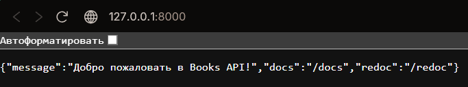
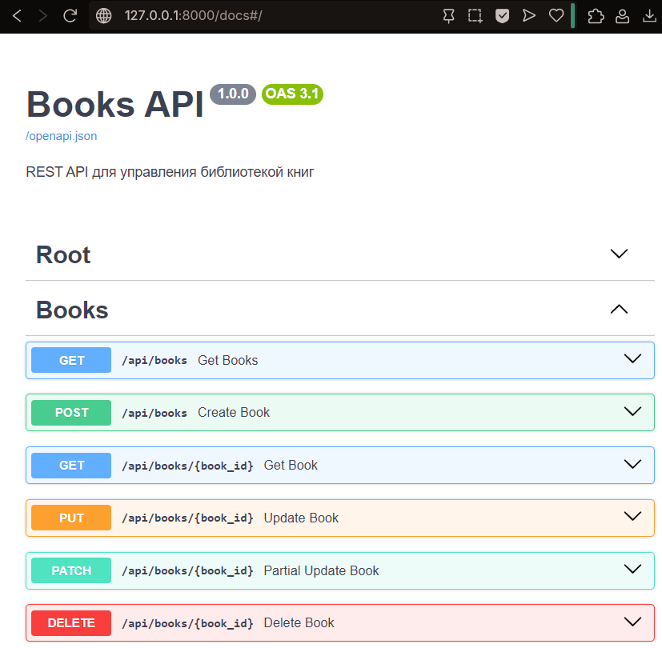
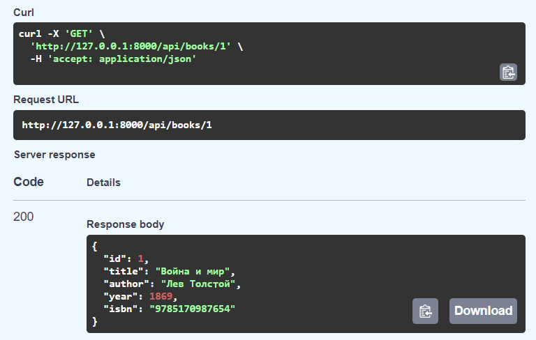

# Щеткин Дмитрий ИВТ 2.1

## Лабораторная работа - Разработка REST API и работа с OpenAPI

### Инструкция

1. Установите необходимые библиотеки: `pip install fastapi uvicorn pydantic`
2. Запуск сервера: `uvicorn main:app --reload`

### Отчет

### Создание простого REST API

[Код](https://github.com/Mytyai/4-course/tree/main/prog-7/lab7/fastapi_books)

Результат выполнения кода:

### Тестирование API через Swagger UI

При запуске сервера, Swagger UI доступен по /docs:

Пример выполнения операции:

### Изучение OpenAPI спецификации

Полученный файл: [openapi.json](https://github.com/Mytyai/4-course/tree/main/prog-7/lab7/fastapi_books/openapi.json)

### Ответы на контрольные вопросы

1. Что такое REST и шесть принципов
- REST — архитектурный стиль для веб-сервисов
- Принципы: клиент-сервер, stateless, кэширование, единообразный интерфейс, слои, код по требованию (опционально)

2. Разница между PUT и PATCH
- PUT — полное обновление ресурса
- PATCH — частичное обновление

3. Идемпотентность HTTP методов
- Повторный запрос не изменяет результат
- Идемпотентные: GET, PUT, DELETE
- Неидемпотентные: POST

4. HTTP коды состояния
- Успех: 200, 201, 204
- Ошибки клиента: 400, 401, 403, 404, 422
- Ошибки сервера: 500, 502, 503

5. OpenAPI Specification
- Стандарт описания REST API в JSON/YAML
- Используется для документации, тестирования и генерации клиентов

6. Разница OpenAPI и Swagger
- OpenAPI — спецификация
- Swagger — инструменты для работы с OpenAPI

7. Преимущества FastAPI
- Высокая скорость и асинхронность
- Автогенерация документации
- Встроенная валидация данных
- Поддержка аннотаций типов

8. Pydantic в FastAPI
- Библиотека для валидации и сериализации данных через модели BaseModel

9. Автоматическая документация FastAPI
- Использует Pydantic и аннотации типов
- Swagger UI /docs, ReDoc /redoc, OpenAPI JSON /openapi.json

10. Валидация данных
- Проверка корректности входных данных
- Предотвращает ошибки и неконсистентность

11. Stateless
- Сервер не хранит состояние клиента
- Каждый запрос содержит всю необходимую информацию

12. Компоненты OpenAPI
- info — метаданные
- paths — эндпоинты
- components — схемы, security, параметры
- servers — адреса серверов
- tags — группы эндпоинтов

13. Обработка ошибок в FastAPI
- Через HTTPException(status_code, detail)
- Можно использовать кастомные обработчики @app.exception_handler

14. HATEOAS
- Ответы содержат ссылки на возможные действия с ресурсом (обновление, удаление и др.)

15. Методы аутентификации в REST API
- API ключи
- Basic Auth
- OAuth2/JWT
- Session-based
- OpenID Connect
