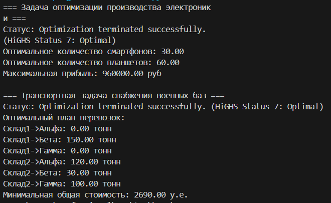
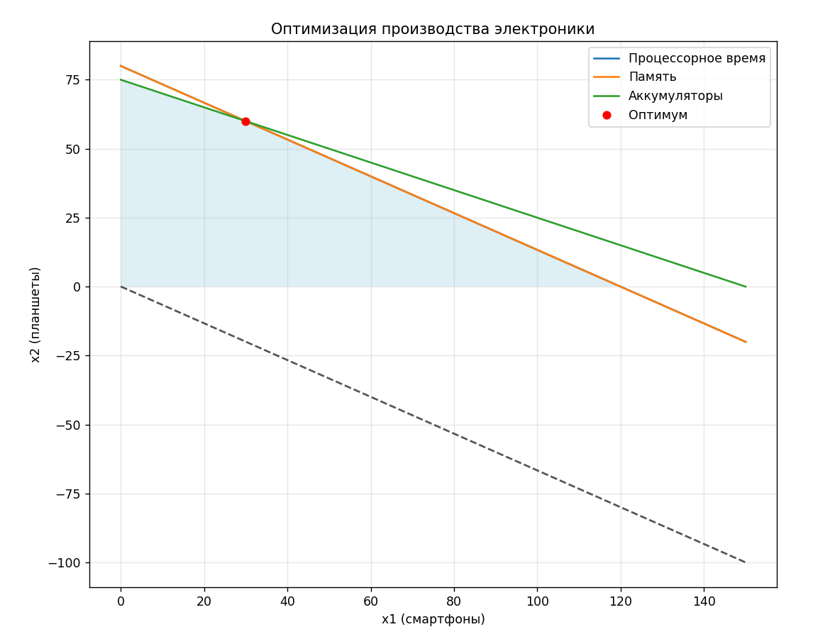
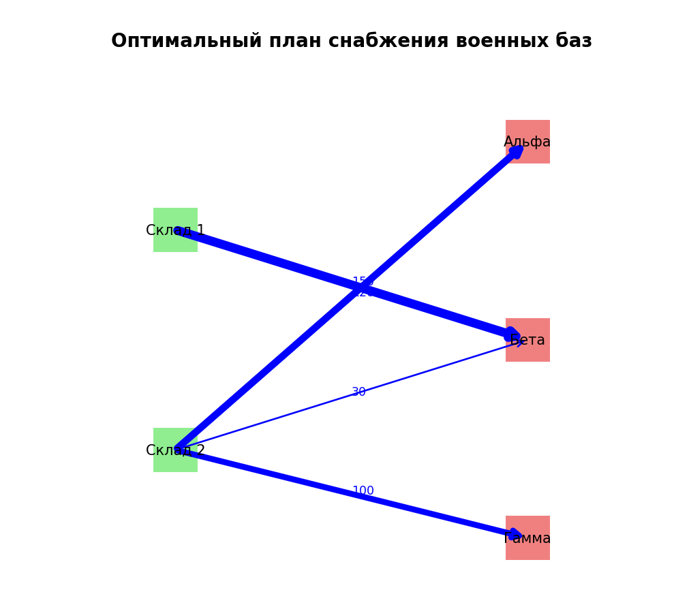

# Щеткин Дмитрий ИВТ 2.1

## Лабораторная работа - Линейное Программирование в Задачах Оптимизации

### Отчет

[Код](https://github.com/Mytyai/4-course/tree/main/prog-7/lab8/code)

Результат выполнения кода:

### Анализ результатов

В задаче оптимизации производства электроники оптимальный план предусматривает выпуск 30 смартфонов и 60 планшетов, что обеспечивает максимальную прибыль в размере 960 000 рублей. Все имеющиеся ресурсы используются полностью, поэтому все ограничения являются активными, а каждый ресурс является дефицитным. Это означает, что увеличение запаса любого ресурса приведёт к росту прибыли компании.

В транспортной задаче получен оптимальный план снабжения военных баз с минимальной суммарной стоимостью 2690 условных единиц. Все потребности баз полностью удовлетворены, а склады полностью разгружены, при этом используются только экономически наиболее выгодные маршруты. Полученное решение является логистически обоснованным и устойчивым к умеренным изменениям параметров задачи.

### Ответы на контрольные вопросы

1. В `linprog` минимизация — стандартная задача; для максимизации нужно минимизировать `-f`.  

2. Множители Лагранжа показывают, насколько изменение ограничения влияет на оптимальное значение функции; экономически — это цена ресурса.  

3. Условия ККТ: градиент функции + линейная комбинация градиентов активных ограничений = 0, ограничения выполняются, множители ≥ 0, комплементарная нежёсткость.  

4. Активное ограничение — ограничение, которое выполняется как равенство в оптимуме; определяется по решению, если `Ax = b`.  

5. Симплекс-метод движется по вершинам многогранника; методы внутренней точки — через внутренние точки области допустимых решений.  

6. Двойственная задача строится из прямой, меняя цели и ограничения; оптимальные значения прямой и двойственной совпадают (теорема двойственности).  

7. Транспортная задача сбалансирована, если суммарное предложение = суммарный спрос.  

8. Если несбалансированная, добавляют фиктивный пункт (поставщика или потребителя) с нулевыми или большими затратами, чтобы сбалансировать.
