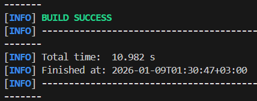
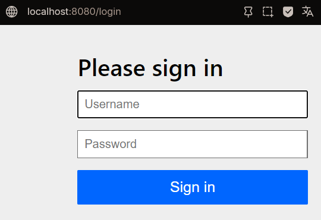

# Щеткин Дмитрий ИВТ 2.1

## Практическая работа - RESTful веб-приложение на Spring Boot

### Инструкция

1. Компиляция приложения: `mvn clean install`
2. Запуск приложения: `mvn spring-boot:run`

### Отчет

[Код](https://github.com/Mytyai/4-course/tree/main/prog-7/prac2/taskmanager)

Сборка приложения:

Запуск приложения:

