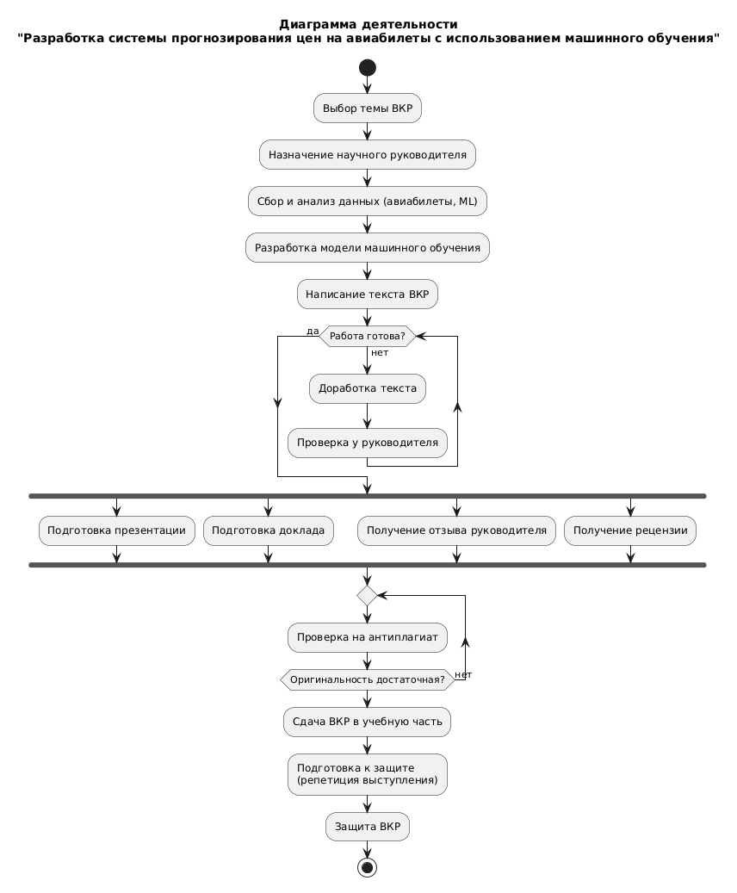

# Щеткин Дмитрий ИВТ 2.1

## Задание 1. Диаграмма деятельности



Код Plant UML:
```
@startuml
title Диаграмма деятельности\n"Разработка системы прогнозирования цен на авиабилеты с использованием машинного обучения"

start

:Выбор темы ВКР;
:Назначение научного руководителя;

:Сбор и анализ данных (авиабилеты, ML);
:Разработка модели машинного обучения;
:Написание текста ВКР;

while (Работа готова?) is (нет)
  :Доработка текста;
  :Проверка у руководителя;
endwhile (да)

fork
  :Подготовка презентации;
fork again
  :Подготовка доклада;
fork again
  :Получение отзыва руководителя;
fork again
  :Получение рецензии;
end fork

repeat
  :Проверка на антиплагиат;
repeat while (Оригинальность достаточная?) is (нет)

:Сдача ВКР в учебную часть;
:Подготовка к защите\n(репетиция выступления);
:Защита ВКР;

stop
@enduml
```