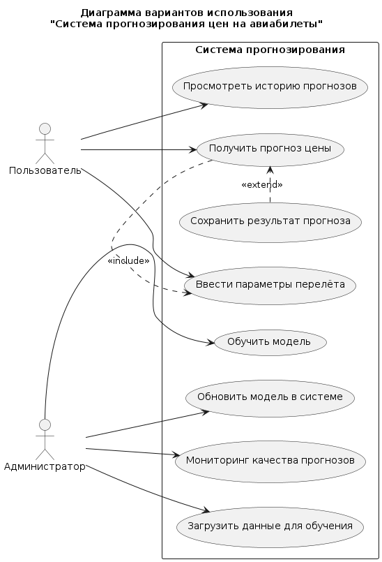
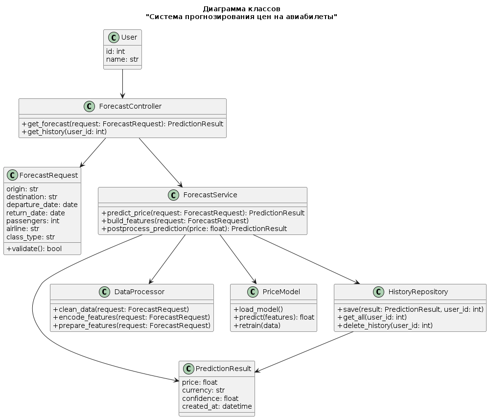
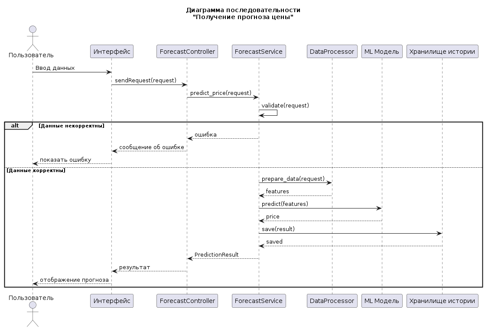
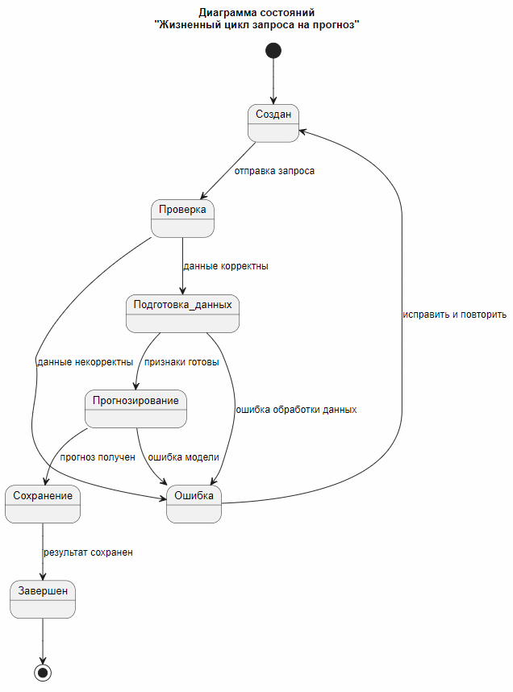
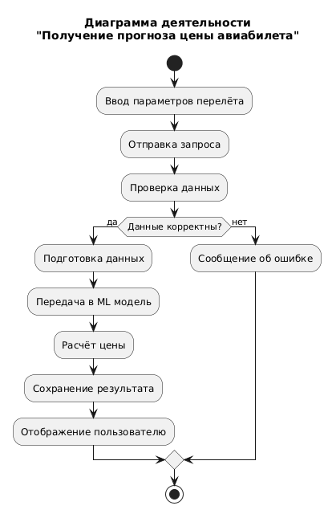

# Щеткин Дмитрий ИВТ 2.1

## Задание 2. Создание диаграмм для ВКР

Диаграмма вариантов использования (use case):
[Код](https://github.com/Mytyai/4-course/tree/main/spec-langs-8/lab2/code/usecase.puml)

Диаграмма вариантов использования отражает основные сценарии взаимодействия пользователей с системой прогнозирования цен на авиабилеты. Основным актором является пользователь, который вводит параметры перелёта, получает прогноз стоимости билета и при необходимости сохраняет результат или просматривает историю прогнозов.

Администратор выполняет функции поддержки системы: осуществляет загрузку обучающих данных, запускает процесс обучения модели, обновляет модель в системе и контролирует качество прогнозов. Это обеспечивает актуальность и точность работы алгоритмов машинного обучения.

Диаграмма классов (classes): 
[Код](https://github.com/Mytyai/4-course/tree/main/spec-langs-8/lab2/code/classes.puml)

Диаграмма классов отражает структуру системы прогнозирования цен на авиабилеты и взаимодействие ее основных компонентов. Центральным элементом является сервис прогнозирования, который получает запросы от контроллера, обрабатывает входные данные, формирует признаки и передает их в модель машинного обучения для получения предсказания стоимости билета.

Контроллер обеспечивает взаимодействие с внешним интерфейсом и принимает запросы пользователя, передавая их в сервисный слой. Для подготовки данных используется отдельный компонент, отвечающий за очистку и преобразование признаков. Модель машинного обучения выполняет расчет прогнозной стоимости на основе входных параметров.

Диаграмма последовательности (sequence): 
[Код](https://github.com/Mytyai/4-course/tree/main/spec-langs-8/lab2/code/sequence.puml)

Диаграмма последовательности демонстрирует взаимодействие компонентов системы при выполнении прогноза. Пользователь через интерфейс передаёт данные в сервис, который обрабатывает их, передаёт модели машинного обучения и получает результат, возвращаемый пользователю.

Диаграмма состояний (state): 
[Код](https://github.com/Mytyai/4-course/tree/main/spec-langs-8/lab2/code/state.puml)

Диаграмма состояний отражает жизненный цикл запроса на прогноз. Запрос проходит этапы создания, проверки, обработки и получения результата. При возникновении ошибок предусмотрен возврат к начальному состоянию для повторной обработки.

Диаграмма деятельности (activity): 
[Код](https://github.com/Mytyai/4-course/tree/main/spec-langs-8/lab2/code/activity.puml)

Диаграмма деятельности отражает процесс получения прогноза стоимости авиабилета. Она включает этапы ввода данных пользователем, проверки корректности, обработки информации, выполнения прогноза с использованием модели машинного обучения и отображения результата. В случае некорректных данных предусмотрена обработка ошибки.
